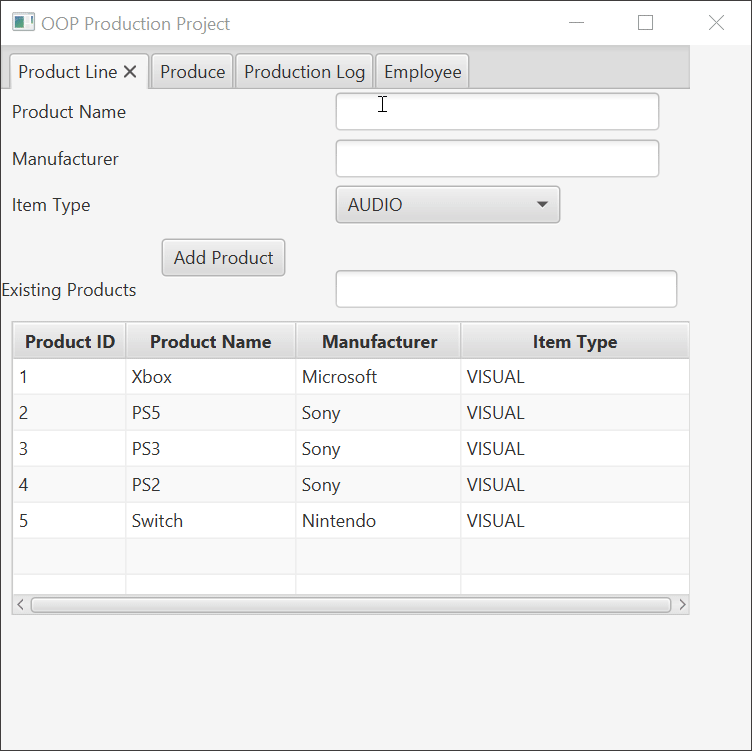
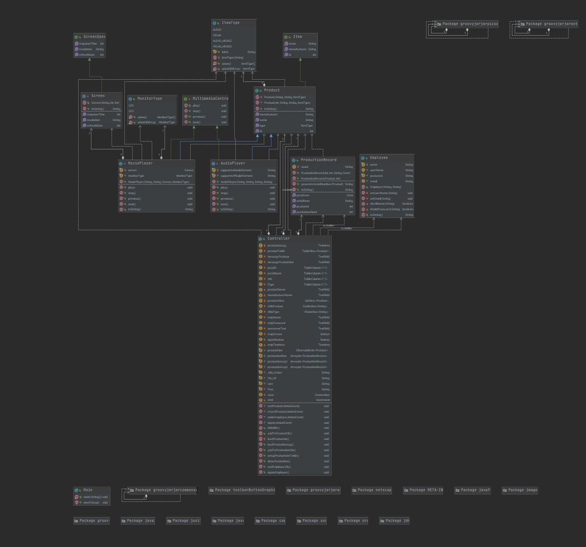
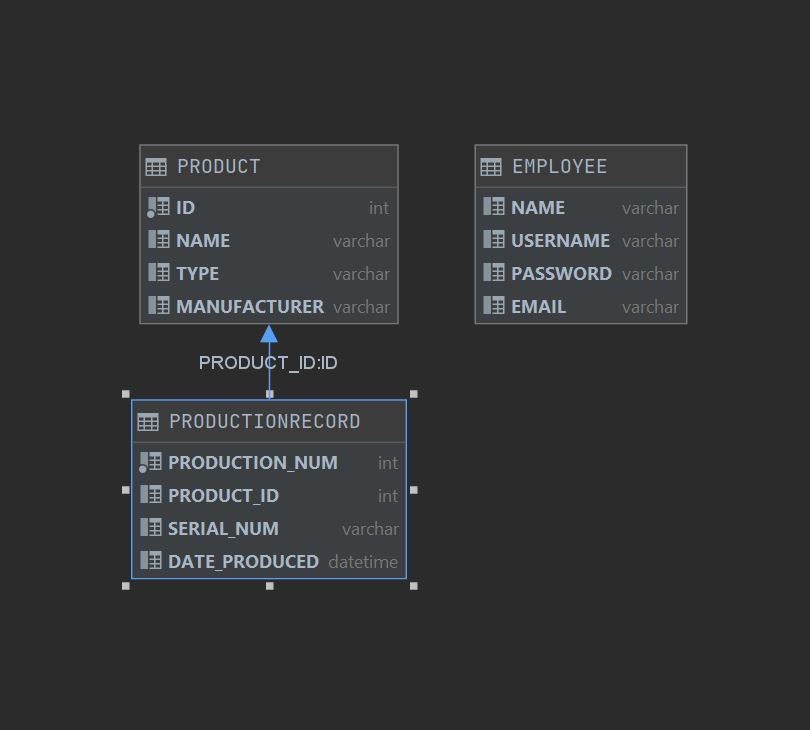

# OOP Production Project
The project is a program that keeps records of products made. The program also ulitizes databases to keep records of previous products produced and employee accounts.
This project was made by me and was done independently, no team was involved with the making of the program.
This project was made as part of my semester long assignment at FGCU. The name of the class was called Object Oriented Programming.
Making this project was an experience. I've learned alot about OOP and this project reflects all that I've learned and done during my time
in that class. To whoever sees this, I thank you for having the time to see what I've made.

## Demonstration
 
 
## Documentation
[JavaDoc](https://bsantiago25.github.io/OOPProduction/javadocs/index.html)

## Diagrams

## Getting Started
Just download my project from here and use your Java developing software such as Intellij
to run it. This project does use JDK11 and H2 for the database to run however so make sure you have all that.

## Built With
Intellij IDEA 2020 
Gluon Scenebuilder 
H2 Database

## Contributing
Contribution is greatly appreciated and if there is ways on improving my project, try it and let me know.

## Author
Brandon Santiago

## Acknowledgments
Professor Scott Vanselow for helping me with my Production Record and Jeremy Martin with the H2 database.

## History

## Key Programming Concepts Utilized
Enums 
Arraylists 
Regular Expressions 
SQL 
Objects 
